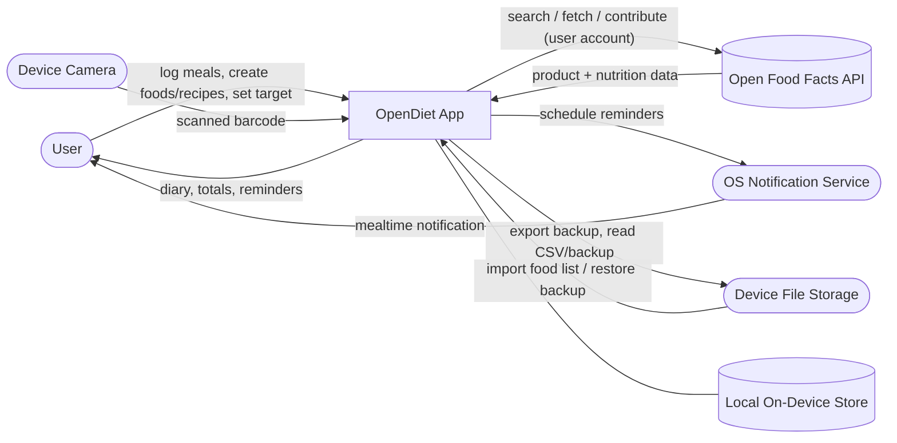

# Software Glance: OpenDiet

**Version:** 1.0 | **Created:** 2026-06-19
**Input:** `00-business-context.md`, `01-customer-problems.md`

> Conceptual solution view only. Technology and architecture choices are recorded in `04-software-vision.md` and `AGENTS.md`, not here.

## Description

OpenDiet is an on-device mobile application through which a single user records what they eat in a daily diary organized into their own meal slots. The user fills and grows a personal catalog of foods and recipes by searching Open Food Facts, scanning a product barcode, importing an existing food list from a file, or creating foods and recipes by hand; everything they save lives in a local store on the device. The app totals nutrition per day against a target the user sets, reminds them around mealtimes through the device's notification service, and lets them export and re-import their whole dataset as a file so it survives device loss. All data stays on the device, and the only outbound interaction is the user's own authenticated access to Open Food Facts.

## System Diagram



## System Boundary

**Actors:**
- **User:** The single person who logs food, manages foods/recipes, sets a target, and triggers import/export.

**External Systems:**
- **Open Food Facts API:** Source of product and nutrition data; accepts authenticated contributions from the user's own account.
- **Device Camera:** Supplies scanned barcodes for product lookup.
- **OS Notification Service:** Delivers mealtime reminders.
- **Device File Storage:** Holds import sources (CSV) and backup files produced/consumed by the app.

## High-Level Components

- **Diary:** Records food entries per day within the user's meal slots and shows daily nutrient totals against the target.
- **Food & Recipe Catalog:** The user's personal collection of foods and recipes, including per-serving recipe nutrition.
- **Food Data Access:** Brings food data in from Open Food Facts (search and barcode), from imported files, and from hand-entered items, into a single catalog.
- **Reminders:** Schedules and delivers mealtime prompts.
- **Backup & Exchange:** Exports the full dataset and imports food lists and prior backups.
- **Local Store:** Persists all foods, recipes, diary entries, settings, and the target on the device.
- **Settings & Profile:** Holds unit-system preference, meal-slot configuration, target, and the Open Food Facts account link.

## Interfaces

| Interface | Type | Connected To | Purpose |
|-----------|------|--------------|---------|
| App UI | Local | User | Logging, catalog management, totals, settings |
| Open Food Facts | API | Open Food Facts | Search, fetch by barcode, contribute products |
| Barcode capture | Local (device) | Device Camera | Identify a packaged food to look up |
| Reminder scheduling | Local (device) | OS Notification Service | Mealtime prompts |
| File exchange | Local (device) | Device File Storage | CSV import, backup export/import |
| Local persistence | Local | Local Store | Durable on-device storage of all user data |

## Data Considerations

The app stores foods, recipes (with ingredients and yield), diary entries (food/recipe + amount + meal + day), the user's meal slots, unit preference, daily target, quick-entry history (recents/favorites/searches), and the Open Food Facts account link. Food data originates from Open Food Facts, imported files, or direct user entry; all other data originates from the user. Persistence is entirely on-device, with a file-based export/import path as the only way data crosses the device boundary (besides Open Food Facts requests).

## Traceability

| CP | How the Glance Addresses It |
|----|------------------------------|
| CP-001 | All data persists in the local store; only user-initiated Open Food Facts calls leave the device |
| CP-002 | Diary, catalog, and totals operate against the local store, independent of the network |
| CP-003 | Backup & Exchange exports/imports the full dataset as a file |
| CP-004 | A single self-contained app with no gating component or ad surface |
| CP-005 | Food Data Access unifies Open Food Facts, barcode, imported, and hand-entered foods, with detailed nutrient data |
| CP-006 | Backup & Exchange imports an existing food list from a file |
| CP-007 | Food & Recipe Catalog computes per-serving recipe nutrition |
| CP-008 | Quick-entry history (recents/favorites/searches) in the Diary speeds repeat logging |
| CP-009 | Reminders schedules mealtime prompts via the notification service |
| CP-010 | The Local Store and totals are the integrity-critical core; data never silently leaves it |
| CP-011 | Settings & Profile holds the unit-system preference applied across entry and display |
```

