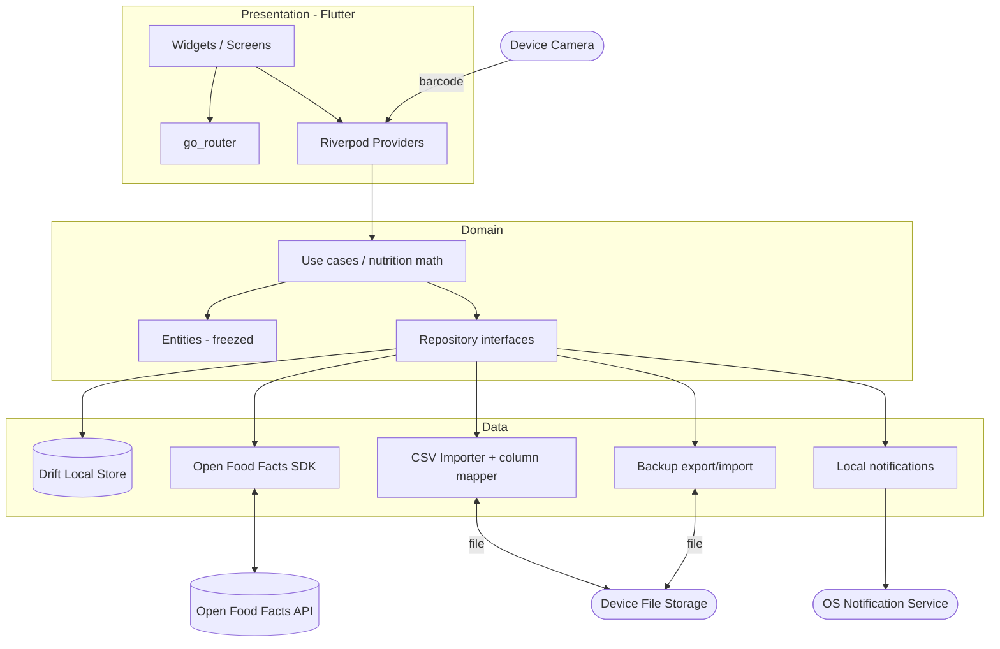

# Software Vision: OpenDiet

**Version:** 1.0 | **Created:** 2026-06-19
**Input:** `02-software-glance.md`, `03-customer-needs.md`
**Cross-reference:** System boundaries and actors are defined in `02-software-glance.md`.

## Vision

**For** privacy-conscious individuals who track their diet and manage their own foods and recipes,
**Who** want full control of their nutrition data without surrendering it to a cloud vendor,
**The** OpenDiet **is a** local-first mobile diet tracker and food/recipe manager
**That** keeps all data on the device, works offline, and lets users own and move their data freely,
**Unlike** cloud calorie trackers that require accounts, gate features behind paywalls, and monetize personal data,
**Our product** stores everything locally, builds on open food data (Open Food Facts), and stays free of ads and paywalls.

## Stakeholders

| Stakeholder | Role | Interest |
|-------------|------|----------|
| User | Single on-device user | Fast logging, accurate nutrition, data ownership, privacy |
| Project Owner | Solo open-source maintainer | Ship a usable, private, maintainable app |
| Development | Solo developer + AI assistant | Feasibility, testability, clarity |
| Open Food Facts | External data provider/API | Crowd-sourced food data; user contributions back |
| Device Camera | External (device) | Barcode capture |
| OS Notification Service | External (device) | Mealtime reminders |
| Device File Storage | External (device) | CSV import and backup files |

## Product Overview

**Purpose:** Let a person record what they eat, manage their own foods and recipes, and see daily nutrition, entirely on their device.

**Scope (in):** Daily diary, customizable meals, custom foods, recipes, Open Food Facts search + barcode + contribution, CSV import with flexible mapping, daily totals against a manual target, quick-entry helpers, mealtime reminders, full backup export/import, metric/imperial units, single profile, iOS + Android.

**Scope (out, v1):** Cloud accounts/sync (beyond the user's OFF account), meal planning + shopping lists, goals engine (BMR/TDEE), weight/progress tracking, multiple profiles, web/desktop, any medical advice.

**Key Benefits:**
1. Privacy by default — data never leaves the device unbidden.
2. Works offline — log anywhere.
3. Data ownership — full export/import.
4. Logs the foods you actually eat — packaged, imported, or homemade, with micronutrient detail.
5. Free of paywalls and ads.

**Success Metrics:** See `00-business-context.md` SC-01..SC-05 (offline coverage, round-trip backup fidelity, arbitrary-CSV import, zero telemetry endpoints, nutrition math under test).

## High-Level Features

| Feature | Description | Traces to CN | Priority |
|---------|-------------|--------------|----------|
| Food diary | Record entries per day in user-defined meal slots; flexible quantity (servings or weight/volume) | CN-002, CN-013 | Must |
| Food & recipe catalog | Create custom foods (full label + micronutrients); build recipes with yield and per-serving nutrition; log recipes by servings | CN-006, CN-010, CN-011 | Must |
| Open Food Facts integration | Search and barcode-scan products; contribute new/corrected products with the user's OFF account | CN-007, CN-008 | Must (contribute: Should) |
| CSV import | Import a food list from a CSV, mapping arbitrary columns to OpenDiet fields | CN-009 | Must |
| Daily totals + target | Show per-day nutrient totals against a user-set target | CN-015 | Must |
| Quick entry | Recently logged, favorites, copy a previous day/meal, search history | CN-012 | Should |
| Reminders | Configurable mealtime local notifications | CN-014 | Should |
| Backup & restore | Export the full dataset to a file; import/restore it | CN-003, CN-004 | Must |
| Units | Enter and display amounts in metric or imperial | CN-017 | Must |
| Privacy & integrity | Local-only storage; integrity-preserving local store | CN-001, CN-016 | Must |
| ANVISA nutrition table | Universal table: 10 mandatory nutrients (incl. added sugars, trans fat) + micros, shown per 100 g/ml + per serving with %VD | CN-018, CN-019 | Must |
| %VD reference sets | %VD computed from a region-selected reference set (Brazil/US/EU), defaulted from locale | CN-019 | Must |
| pt-BR localization | Full Brazilian Portuguese UI + pt-BR formatting; language defaulted from device, overridable | CN-020 | Must |
| TACO import | Import the user's own TACO-format file via the CSV importer preset (not bundled) | CN-021 | Should |

## Environment and Constraints

- **Deployment:** Mobile app, iOS and Android. No backend; entirely on-device.
- **Technical stack (decided; see `AGENTS.md`):** Flutter/Dart; Drift (on-device SQLite) for the local store; Riverpod (code-gen) for state; freezed + json_serializable for models; go_router for navigation; official `openfoodfacts` SDK; very_good_analysis with strict analyzer modes; build_runner for codegen.
- **Integration (required):** Open Food Facts API; device camera (barcode); OS local-notification service; device file storage (CSV import, backup).
- **Brazilian compliance & i18n:** Nutrition format follows ANVISA RDC 429/2020 + IN 75/2020 (source of truth; %VD reference values held in a single test-verified table, not restated in code). UI localized via Flutter gen-l10n (pt-BR + en). TACO/TBCA are restricted-use -- imported from the user's own file, never bundled.
- **Security/Privacy:** No analytics/telemetry endpoints. Open Food Facts credentials held in platform secure storage, never bundled or committed. Per-user OFF authentication only.
- **Performance:** Local reads/writes feel instant; Open Food Facts calls are asynchronous with explicit offline/timeout handling and must never block local logging.
- **Compatibility:** Current supported iOS and Android OS versions (exact floors set at scaffold time).

## High-Level Architecture

Feature-first layering (presentation / domain / data) per `AGENTS.md`. Conceptual blocks only; detailed design is later.

**Architectural rules (from `AGENTS.md`):** food sources (OFF, CSV, custom) sit behind repository interfaces; domain logic never depends on a concrete data source or on widgets; all data stays local except user-initiated OFF requests.
