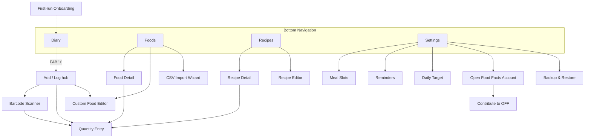

# OpenDiet UI Design — Index

**Version:** 1.0 | **Created:** 2026-06-19
**Status:** Design (HOW). Downstream of `.spec/functional-requirements/`. Not a requirement; every screen traces back to FRs.

Primary navigation: **bottom navigation, 4 tabs** (Diary, Foods, Recipes, Settings) with a **FAB** on Diary that opens the Add/Log flow.
Theme: **Material 3**, single brand seed color, light + dark following the system. See `design-system.md`.
Nutrition is shown as the **universal ANVISA table** (per 100 g/ml + per-porção + %VD; FR-026/027) on every food/recipe. The UI is **localized** (English base + pt-BR; FR-029), with language and %VD-region as **independent** settings.

## Navigation map

## Screen inventory & FR traceability

| ID | Screen | Tab/Flow | Traces to FR | File |
|----|--------|----------|--------------|------|
| S-01 | Diary (home) | Diary | FR-002, FR-003, FR-004, FR-019, FR-022 | `screens-diary-logging.md` |
| S-02 | Add / Log hub | Flow (FAB) | FR-003, FR-009, FR-011, FR-017, FR-018 | `screens-diary-logging.md` |
| S-03 | Barcode Scanner | Flow | FR-010 | `screens-diary-logging.md` |
| S-04 | Quantity Entry | Flow | FR-003, FR-017, FR-024 | `screens-diary-logging.md` |
| S-05 | Custom Food Editor | Flow / Foods | FR-008, FR-024, FR-028 | `screens-diary-logging.md` |
| S-06 | Foods (catalog) | Foods | FR-008, FR-009, FR-011 | `screens-foods-recipes.md` |
| S-07 | Food Detail | Foods | FR-011, FR-012, FR-018, FR-026, FR-027 | `screens-foods-recipes.md` |
| S-08 | Recipes (list) | Recipes | FR-015 | `screens-foods-recipes.md` |
| S-09 | Recipe Editor | Recipes | FR-015, FR-016 | `screens-foods-recipes.md` |
| S-10 | Recipe Detail | Recipes | FR-016, FR-017 | `screens-foods-recipes.md` |
| S-11 | CSV Import Wizard | Foods / Settings | FR-013, FR-014, FR-030 | `screens-data-settings.md` |
| S-12 | Backup & Restore | Settings | FR-005, FR-006 | `screens-data-settings.md` |
| S-13 | Settings (hub) | Settings | FR-007, FR-019, FR-020, FR-022, FR-024, FR-027, FR-029 | `screens-data-settings.md` |
| S-14 | Meal Slots | Settings | FR-019 | `screens-data-settings.md` |
| S-15 | Reminders | Settings | FR-020, FR-021 | `screens-data-settings.md` |
| S-16 | Daily Target | Settings | FR-022 | `screens-data-settings.md` |
| S-17 | OFF Account & Contribute | Settings | FR-012 | `screens-data-settings.md` |
| S-18 | First-run Onboarding | Flow | FR-024, FR-022, FR-012 | `screens-data-settings.md` |

Every FR-001..FR-024 surfaces in at least one screen (FR-001/FR-023 are invisible persistence/integrity guarantees exercised by all data screens; NFR-001/007 are enforced by the absence of any account wall, ad, or telemetry surface).

## go_router routes

| Route | Screen | Notes |
|-------|--------|-------|
| `/diary` | S-01 | Default tab; `?date=` selects the day |
| `/log` | S-02 | `?slot=&date=` preselect meal slot/day |
| `/log/scan` | S-03 | Camera; pops to S-04 on hit |
| `/log/quantity/:foodRef` | S-04 | `foodRef` = local food, OFF product, or recipe |
| `/foods` | S-06 | |
| `/foods/new`, `/foods/:id/edit` | S-05 | |
| `/foods/:id` | S-07 | |
| `/foods/import` | S-11 | CSV wizard (also linked from Settings) |
| `/recipes` | S-08 | |
| `/recipes/new`, `/recipes/:id/edit` | S-09 | |
| `/recipes/:id` | S-10 | |
| `/settings` | S-13 | |
| `/settings/meals` | S-14 | |
| `/settings/reminders` | S-15 | |
| `/settings/target` | S-16 | |
| `/settings/account` | S-17 | |
| `/settings/backup` | S-12 | |
| `/onboarding` | S-18 | First run only |

## Files
- `design-system.md` — color roles, typography, spacing, shared components, state conventions, units, accessibility.
- `screens-diary-logging.md` — S-01..S-05 (the core loop).
- `screens-foods-recipes.md` — S-06..S-10.
- `screens-data-settings.md` — S-11..S-18.
